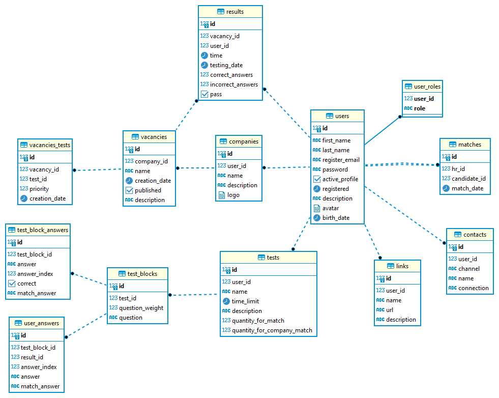

# 1 - Проектирование БД

### Цель:

Спроектировать свою первую базу данных на курсе.

***

### Описание проекта для которого проектируется база данных в PostgreSQL:
<pre>
Платформа представляет из себя первый шаг в собеседовании, цель которого match подходящих кандидатов с работодателем(hr). 

- Шаги работы со стороны компании:
    
    Работодатель регистрируется как компания, заполняет свой профиль. После этого этого создает тесты через конструктор тестов.
	Следующий шаг это создание вакансий с описанием. После этого, работодатель “привязывает” к вакансии необходимые тесты.
	После привязки, тесты будут запущены для пользователя одним блоком. Публикует ваканси.
    
    После публикации работодатель сможет просматривать результаты тестов пользователей.
	Если пользователь успешно прошел набор тестов по вакансии,
	то работодатель получит контакты пользователя по выбранному каналу коммуникации (пока email, telegram).
    
- Шаги работы со стороны пользователя:
    
    Пользователь регистрируется как юзер, заполняет свой профиль. После этого просматривает подходящие ему компании и вакансии. 
	Выбирает понравившуюся вакансию и нажимает “Пройти тестирование на вакансию”. Проходит блок тестов. 
	После теста, может увидеть свой результат. Если тест пройден успешно, то по выбранному каналу коммуникации 
	(email, telegram и т.п.) пользователь получит контакты работодателя, а работодатель получит его контакты. 
 </pre> 

***

### Диаграмма:

***

### <a href="../../script">Table scripts</a>