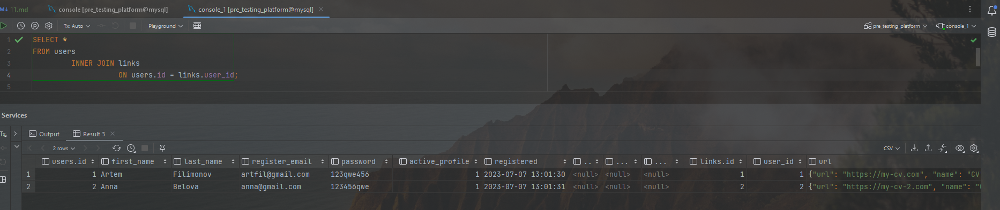

# 11 - DML: вставка, обновление, удаление, выборка данных

### Цель:

- Научиться джойнить таблицы и использовать условия в SQL выборке

***

### 1. Написать запрос по своей базе с inner join:

<pre>
SELECT *
FROM users
         INNER JOIN links
                    ON users.id = links.user_id;
</pre>

### 2. Написать запрос по своей базе с left join:

<pre>
SELECT *
FROM users
         LEFT JOIN links
                    ON users.id = links.user_id;
</pre>

### 3. Написать 5 запросов по своей базе с WHERE с использованием разных операторов:

1. Пользователи с почтой gmail

<pre>
select *
from users
where register_email like '%gmail%';
</pre>

2. По дате регистрации

<pre>
select *
from users
where users.registered > '20230707130500';
</pre>

3. По имени ссылки

<pre>
select *
from links
where JSON_EXTRACT(url, '$.name') = 'CV';
</pre>

4. По последним буквам фамилии

<pre>
select *
from users
where users.last_name like '%ov';
</pre>

5. По имени

<pre>
select *
from users
where users.first_name = 'Anna';
</pre>

