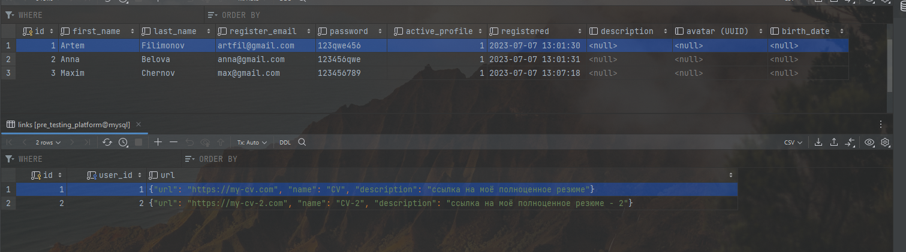
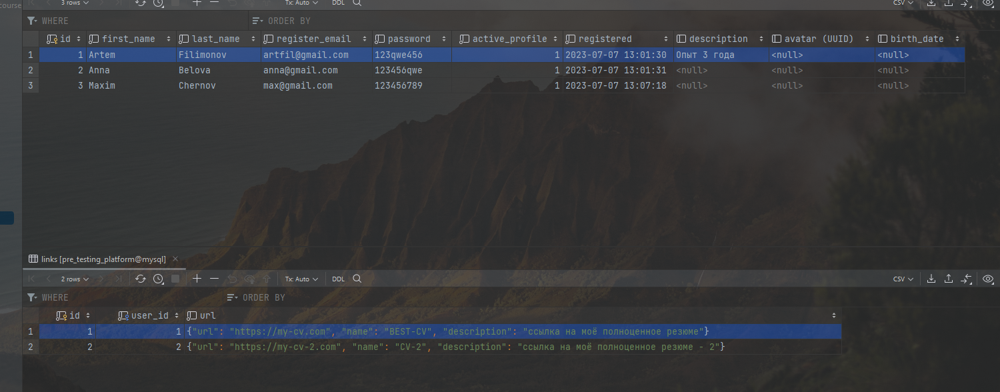
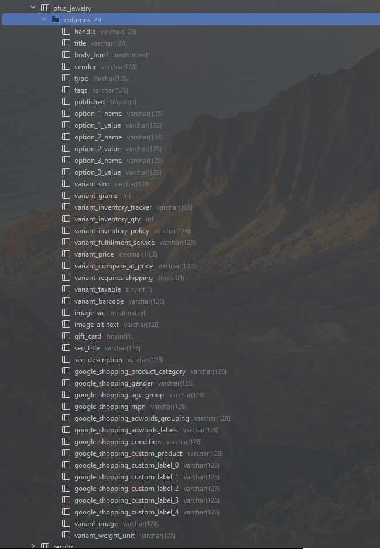
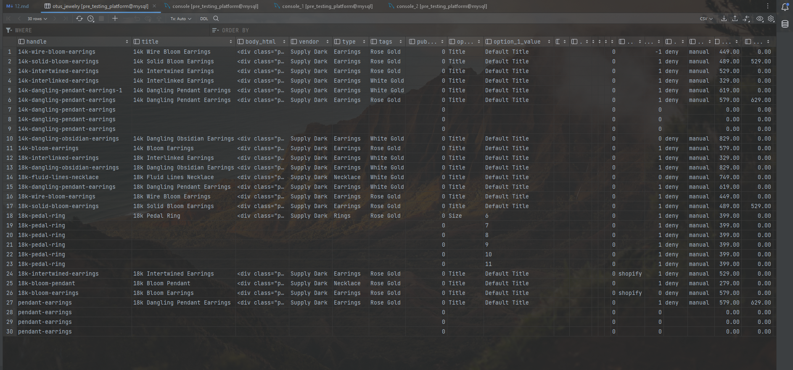

# 12 - Транзакции, MVCC, ACID

### Цель:

- Заполнение своего проекта данными
- Транзакции

***

### 1. Описать пример транзакции из своего проекта с изменением данных в нескольких таблицах:

Транзакция, в которой обновляется пользователь и его ссылка
<pre>
start transaction;

update users
set description = 'Опыт 3 года'
where users.id = '1';

update links
set url = JSON_SET(url, '$.name', 'BEST-CV')
where user_id = '1';

commit;
</pre>

ДО:

ПОСЛЕ:

### 2. Загрузить данные из приложенных в материалах csv:

1. Создали таблицу

<pre>
create table if not exists otus_jewelry
(
    handle                           varchar(128),
    title                            varchar(128),
    body_html                        mediumtext,
    vendor                           varchar(128),
    type                             varchar(128),
    tags                             varchar(128),
    published                        boolean,
    option_1_name                    varchar(128),
    option_1_value                   varchar(128),
    option_2_name                    varchar(128),
    option_2_value                   varchar(128),
    option_3_name                    varchar(128),
    option_3_value                   varchar(128),
    variant_sku                      varchar(128),
    variant_grams                    int,
    variant_inventory_tracker        varchar(128),
    variant_inventory_qty            int,
    variant_inventory_policy         varchar(128),
    variant_fulfillment_service      varchar(128),
    variant_price                    decimal(10, 2),
    variant_compare_at_price         decimal(10, 2),
    variant_requires_shipping        boolean,
    variant_taxable                  boolean,
    variant_barcode                  varchar(128),
    image_src                        mediumtext,
    image_alt_text                   varchar(128),
    gift_card                        boolean,
    seo_title                        varchar(128),
    seo_description                  varchar(128),
    google_shopping_product_category varchar(128),
    google_shopping_gender           varchar(128),
    google_shopping_age_group        varchar(128),
    google_shopping_mpn              varchar(128),
    google_shopping_adwords_grouping varchar(128),
    google_shopping_adwords_labels   varchar(128),
    google_shopping_condition        varchar(128),
    google_shopping_custom_product   varchar(128),
    google_shopping_custom_label_0   varchar(128),
    google_shopping_custom_label_1   varchar(128),
    google_shopping_custom_label_2   varchar(128),
    google_shopping_custom_label_3   varchar(128),
    google_shopping_custom_label_4   varchar(128),
    variant_image                    varchar(128),
    variant_weight_unit              varchar(128)
);
</pre>

2. Загрузили данные

<pre>
LOAD DATA LOCAL INFILE './jewelry.csv'
    INTO TABLE otus_jewelry
    FIELDS TERMINATED BY ','
    ENCLOSED BY '\"'
    LINES TERMINATED BY '\n'
    IGNORE 1 LINES;
</pre>

