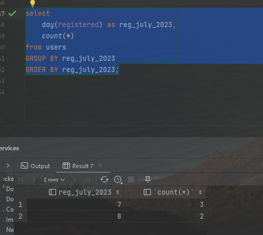
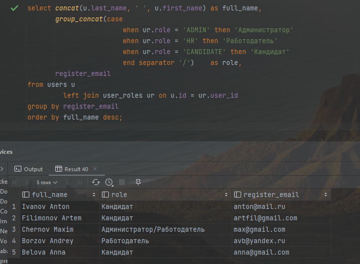
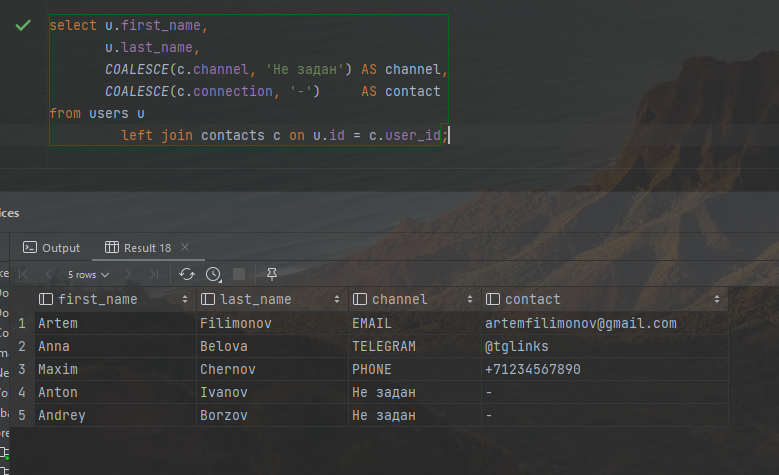
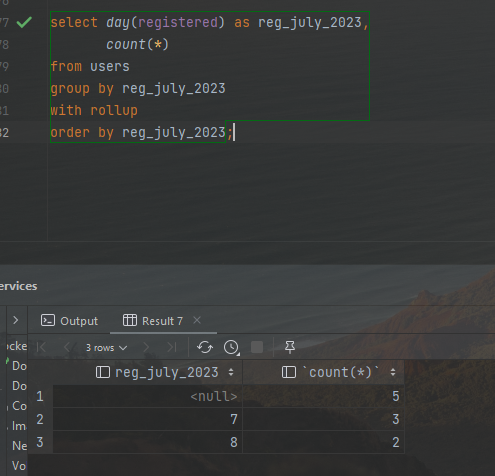

# 13 - DML: агрегация и сортировка

### Цель:

- Научиться создавать отчетную выборку

***

### 1. Реализации группировок под свой проект:

1. Посчитаем количество регистраций в июле по дням

<pre>
select
    day(registered) as reg_july_2023,
    count(*)
from users
GROUP BY reg_july_2023
ORDER BY reg_july_2023;
</pre>

2. Выведем пользователей со сгруппированными ролями, с группировкой по уникальным регистрационным емэйлам

<pre>
select concat(u.last_name, ' ', u.first_name) as full_name,
       group_concat(case
                        when ur.role = 'ADMIN' then 'Администратор'
                        when ur.role = 'HR' then 'Работодатель'
                        when ur.role = 'CANDIDATE' then 'Кандидат'
                        end separator '/')    as role,
       register_email
from users u
         left join user_roles ur on u.id = ur.user_id
group by register_email
order by full_name desc;
</pre>

3. Выведем каналы пользователей с контактами

<pre>
select u.first_name,
       u.last_name,
       COALESCE(c.channel, 'Не задан') AS channel,
       COALESCE(c.connection, '-')     AS contact
from users u
         left join contacts c on u.id = c.user_id;
</pre>

4. Основываясь на первом примере добавим ROLLUP

<pre>
select day(registered) as reg_july_2023,
       count(*)
from users
group by reg_july_2023
with rollup
order by reg_july_2023;
</pre>

