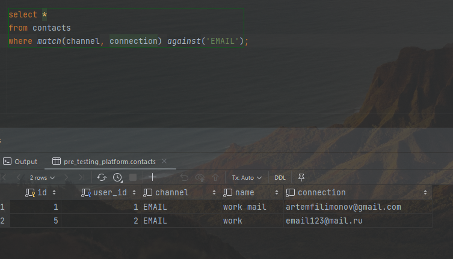
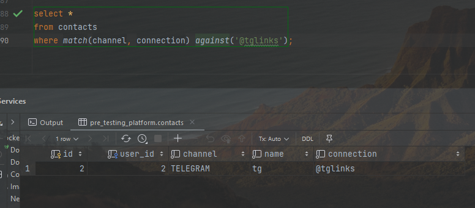

# 14 - Индексы

### Цель:

- Научиться использовать индексы в MySQL

***

### 1. Пересмотреть индексы на своем проекте:

1. Индексы были добавлены в 10 задании, посмотреть можно <a href="../10/script">здесь</a>

2. Убран индекс из таблицы links на уникальное имя ссылки для каждого пользователя из-за преобразования части таблицы в
   json. Также, проанализировав логику данного индекса, был сделан вывод о его необязательности в данном проекте,
   поэтому было решено отказаться добавлять его посредством генерации колонки из json.

### 2. Сделать полнотекстовый индекс:

Был добавлен в таблицу контактов для удобного поиска по контактам и их типам

<pre>
create table if not exists contacts
(
    id         int unsigned not null auto_increment primary key,
    user_id    int unsigned not null,
    channel    varchar(50)  not null,
    name       varchar(50)  not null,
    connection varchar(255) not null,
    fulltext (channel, connection),
    constraint contacts_idx unique (user_id, id),
    foreign key (user_id) references users (id) on delete cascade
);
</pre>

Примеры выборки:

<pre>
select *
from contacts
where match(channel, connection) against('EMAIL');
</pre>

<pre>
select *
from contacts
where match(channel, connection) against('@tglinks');
</pre>

