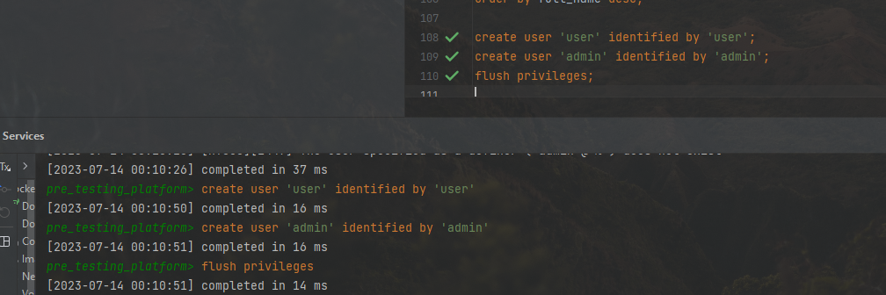

# 15 - Хранимые процедуры и триггеры

### Цель:

- Научиться создавать пользователей, процедуры и триггеры

***

### 1. Создать пользователей user, admin:

<pre>
create user 'user' identified by 'user';
create user 'admin' identified by 'admin';
flush privileges;
</pre>

### 2. Создать процедуру с правами на запуск для - [ user ]  , с выборкой пользователей с конкатенацией их ролей, каналов и контактов:

<pre>
DELIMITER $$
CREATE
    DEFINER = user PROCEDURE UserProcedure()
BEGIN

select concat(u.last_name, ' ', u.first_name)                      as full_name,
       group_concat(case
                        when ur.role = 'ADMIN' then 'Администратор'
                        when ur.role = 'HR' then 'Работодатель'
                        when ur.role = 'CANDIDATE' then 'Кандидат'
                        end separator '/')                         as role,
       register_email,
       group_concat(COALESCE(c.channel, 'Не задан') separator '/') as channels,
       group_concat(COALESCE(c.connection, '-') separator '/')     as contact
from users u
         left join user_roles ur on u.id = ur.user_id
         left join contacts c on u.id = c.user_id
group by register_email
order by full_name desc;

END$$
DELIMITER ;
</pre>

### 3. Создать процедуру с правами на запуск для - [ admin ] , c счетчиком пользователей по году их регистрации:

<pre>
DELIMITER $$
CREATE
    DEFINER = admin PROCEDURE AdminProcedure(IN year YEAR)
BEGIN

    SELECT year,
           count(*)
    FROM pre_testing_platform.users;

END$$
DELIMITER ;
</pre>