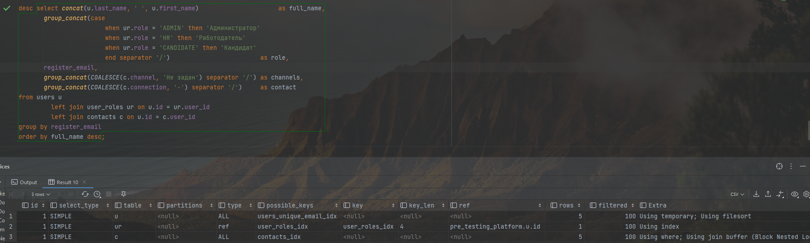

# 16 - Анализ и профилирование запроса

### Цель:

- Проанализировать план выполнения запроса, оценить на чем теряется время

***

### 1. Подготовить сложную выборку с несколькими join и подзапросами:

1. Взяли запрос из 15 задания:

<pre>
select concat(u.last_name, ' ', u.first_name)                      as full_name,
       group_concat(case
                        when ur.role = 'ADMIN' then 'Администратор'
                        when ur.role = 'HR' then 'Работодатель'
                        when ur.role = 'CANDIDATE' then 'Кандидат'
                        end separator '/')                         as role,
       register_email,
       group_concat(COALESCE(c.channel, 'Не задан') separator '/') as channels,
       group_concat(COALESCE(c.connection, '-') separator '/')     as contact
from users u
         left join user_roles ur on u.id = ur.user_id
         left join contacts c on u.id = c.user_id
group by register_email
order by full_name desc;
</pre>

### 2. Построить EXPLAIN в 3 формата:

1. explain

2. json format

<pre>
{
  "query_block": {
    "select_id": 1,
    "cost_info": {
      "query_cost": "5.86"
    },
    "ordering_operation": {
      "using_filesort": true,
      "grouping_operation": {
        "using_temporary_table": true,
        "using_filesort": true,
        "buffer_result": {
          "using_temporary_table": true,
          "nested_loop": [
            {
              "table": {
                "table_name": "u",
                "access_type": "ALL",
                "possible_keys": [
                  "users_unique_email_idx"
                ],
                "rows_examined_per_scan": 5,
                "rows_produced_per_join": 5,
                "filtered": "100.00",
                "cost_info": {
                  "read_cost": "0.25",
                  "eval_cost": "0.50",
                  "prefix_cost": "0.75",
                  "data_read_per_join": "12K"
                },
                "used_columns": [
                  "id",
                  "first_name",
                  "last_name",
                  "register_email"
                ]
              }
            },
            {
              "table": {
                "table_name": "ur",
                "access_type": "ref",
                "possible_keys": [
                  "user_roles_idx"
                ],
                "key": "user_roles_idx",
                "used_key_parts": [
                  "user_id"
                ],
                "key_length": "4",
                "ref": [
                  "pre_testing_platform.u.id"
                ],
                "rows_examined_per_scan": 1,
                "rows_produced_per_join": 6,
                "filtered": "100.00",
                "using_index": true,
                "cost_info": {
                  "read_cost": "1.26",
                  "eval_cost": "0.60",
                  "prefix_cost": "2.61",
                  "data_read_per_join": "1K"
                },
                "used_columns": [
                  "user_id",
                  "role"
                ]
              }
            },
            {
              "table": {
                "table_name": "c",
                "access_type": "ALL",
                "possible_keys": [
                  "contacts_idx"
                ],
                "rows_examined_per_scan": 5,
                "rows_produced_per_join": 30,
                "filtered": "100.00",
                "using_join_buffer": "Block Nested Loop",
                "cost_info": {
                  "read_cost": "0.26",
                  "eval_cost": "3.00",
                  "prefix_cost": "5.87",
                  "data_read_per_join": "42K"
                },
                "used_columns": [
                  "id",
                  "user_id",
                  "channel",
                  "connection"
                ],
                "attached_condition": "<if>(is_not_null_compl(c), (`pre_testing_platform`.`c`.`user_id` = `pre_testing_platform`.`u`.`id`), true)"
              }
            }
          ]
        }
      }
    }
  }
}
</pre>

3. tree format

Не получилось воспроизвести, выдает:

Видим, что в плане запроса используются созданные нами индексы. Также можно отметить низкую стоимость запроса. В данной
ситуации считаю, что запрос пока можно не оптимизировать.
