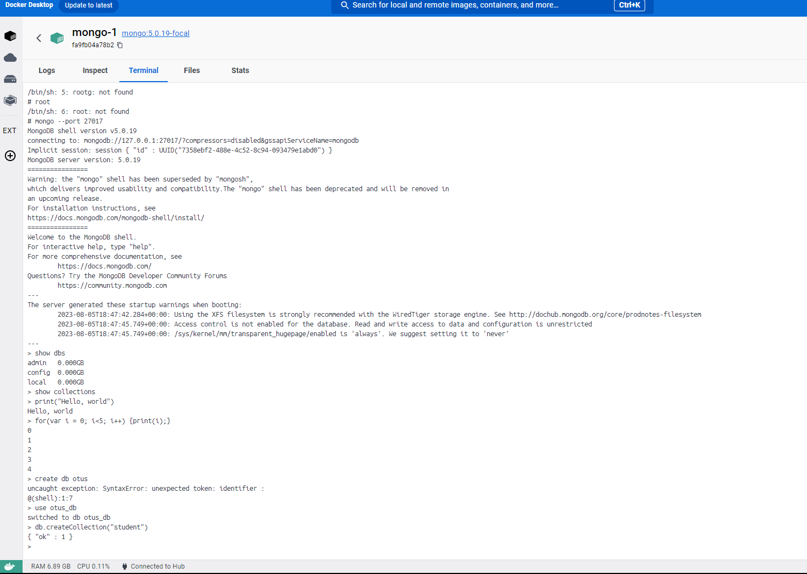
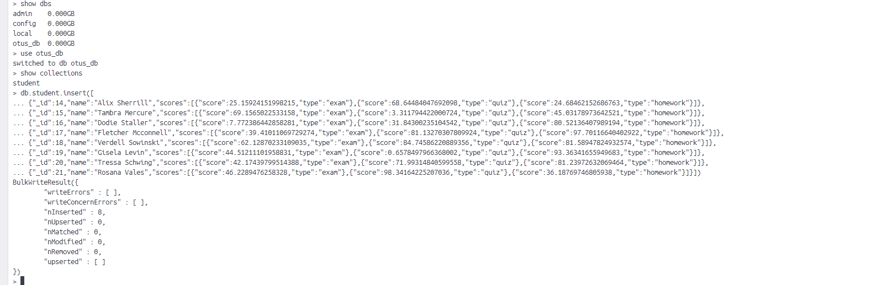
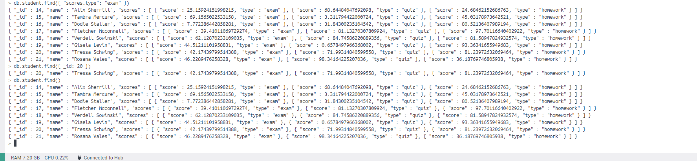
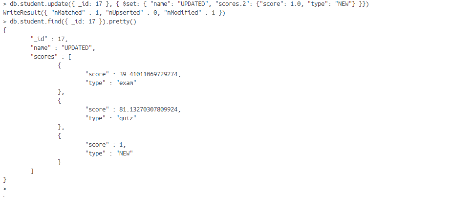

# 20 - MongoDB

### Цель:

- Научиться разворачивать MongoDB, заполнять данными и делать запросы

***

### 1. Установить MongoDB одним из способов: ВМ, докер:

### 2. Заполнить данными:

### 3. Написать несколько запросов на выборку и обновление данных:

