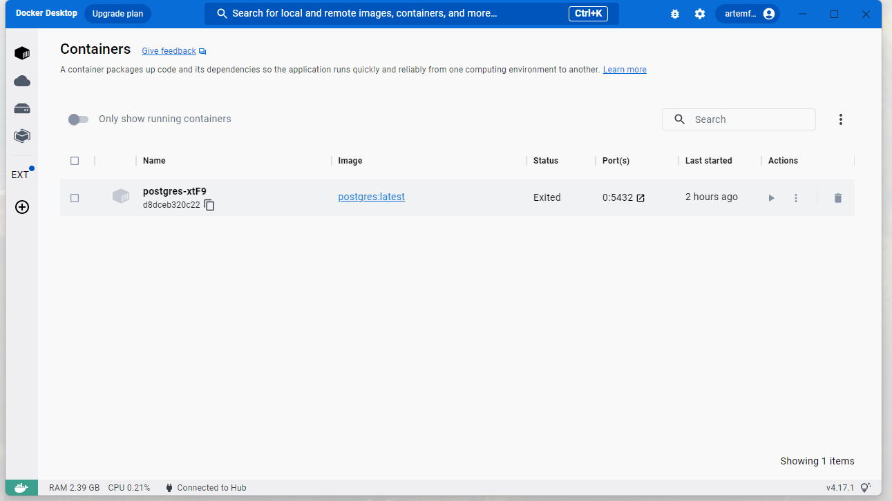
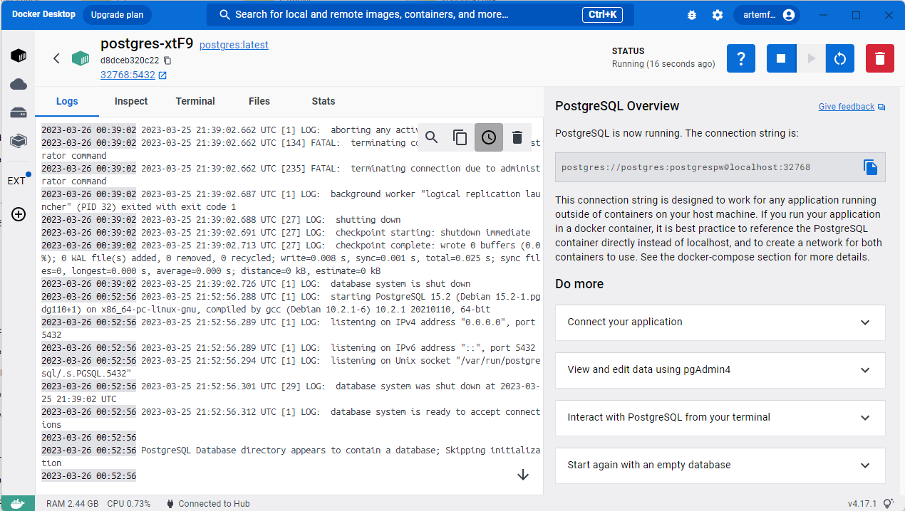
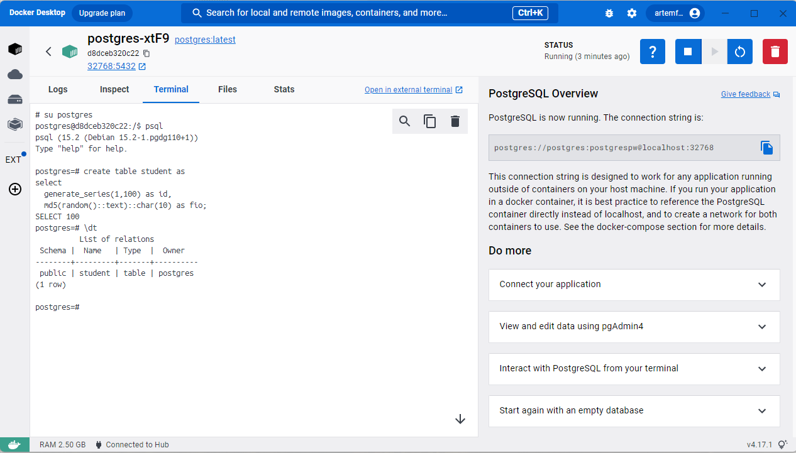
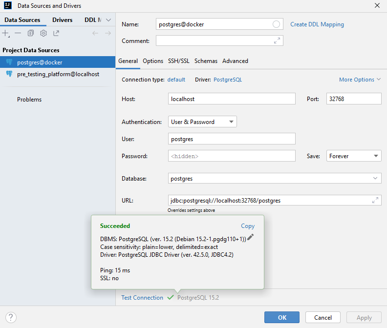
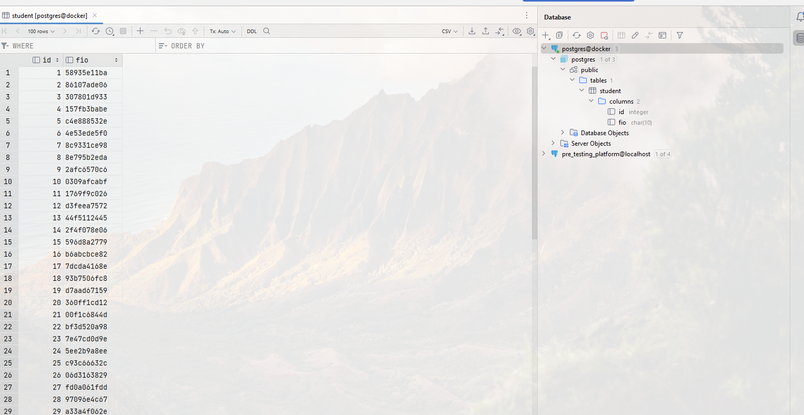

# 3 - Установка СУБД PostgreSQL

### Цель:

Создать кластер PostgreSQL в докере или на виртуальной машине, запустить сервер и подключить клиента.

***

### 1. Развернуть контейнер с PostgreSQL или установить СУБД на виртуальную машину:

### 2. Запустить сервер:

### 3. Создать клиента с подключением к базе данных postgres через командную строку и создать тестовую таблицу:

### 4. Подключиться к серверу используя IntelliJ Idea DB plugin:

