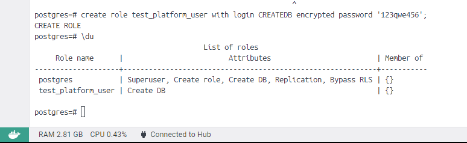
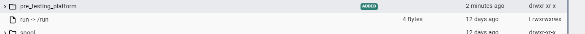
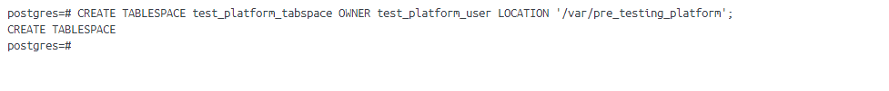
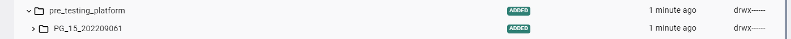
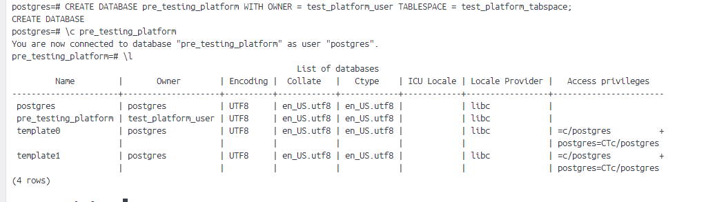
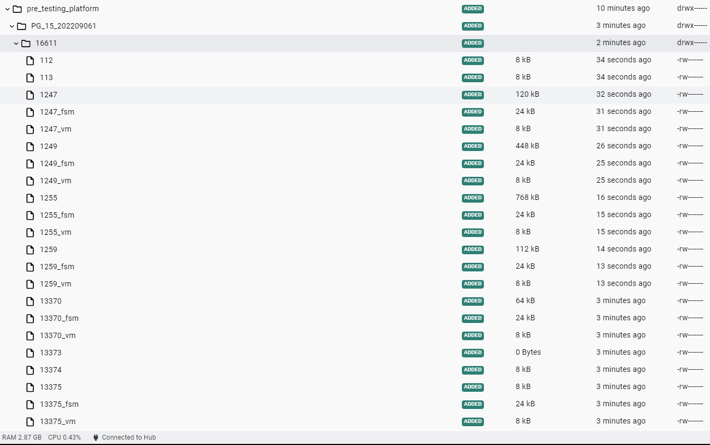
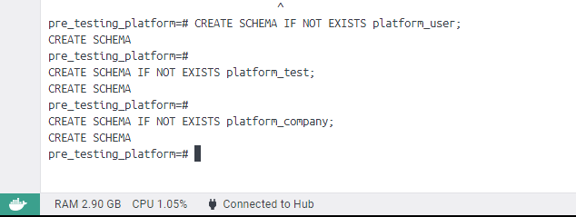
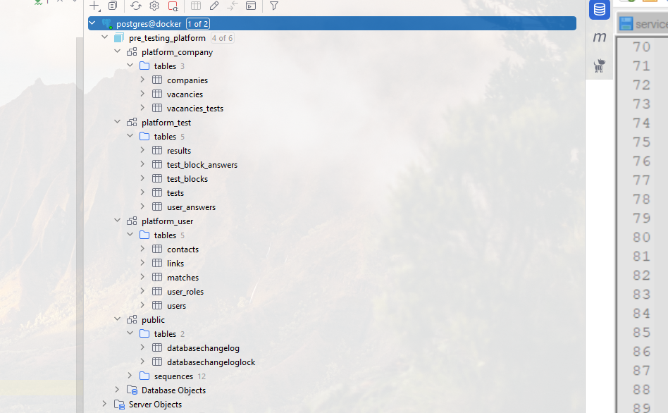

# 1 - DDL скрипты для postgres

### Цель:

Реализовать спроектированную схему в postgres

***

### 1. Подготовить DDL скрипты

* Для начала составили скрипты, с которыми можно ознакомиться <a href="../../script">здесь</a>
* Следующим шагом подготовили первый <a href="changelog-1.0.yaml">changelog</a> для liquibase

### 2. Создать пользователя

### 3. Подготовить табличное пространство

* Создали директорию pre_testing_platform

* Создали табличное пространство

### 4. Создать БД

### 5. Создать схемы

### 6. Выполнить скрипты

<pre>
2023-04-01T14:23:28.396+03:00  INFO 12628 --- [           main] liquibase.database                       : Set default schema name to public
2023-04-01T14:23:28.499+03:00  INFO 12628 --- [           main] liquibase.lockservice                    : Successfully acquired change log lock
2023-04-01T14:23:28.647+03:00  INFO 12628 --- [           main] liquibase.changelog                      : Creating database history table with name: public.databasechangelog
2023-04-01T14:23:28.661+03:00  INFO 12628 --- [           main] liquibase.changelog                      : Reading from public.databasechangelog
Running Changeset: db/changelog/1/changelog-1.0.yaml::1::Filimonov Artem
2023-04-01T14:23:28.749+03:00  INFO 12628 --- [           main] liquibase.changelog                      : SQL in file db/changelog/1/create-table-users.sql executed
2023-04-01T14:23:28.752+03:00  INFO 12628 --- [           main] liquibase.changelog                      : ChangeSet db/changelog/1/changelog-1.0.yaml::1::Filimonov Artem ran successfully in 28ms
Running Changeset: db/changelog/1/changelog-1.0.yaml::2::Filimonov Artem
2023-04-01T14:23:28.763+03:00  INFO 12628 --- [           main] liquibase.changelog                      : SQL in file db/changelog/1/create-table-user-roles.sql executed
2023-04-01T14:23:28.765+03:00  INFO 12628 --- [           main] liquibase.changelog                      : ChangeSet db/changelog/1/changelog-1.0.yaml::2::Filimonov Artem ran successfully in 8ms
Running Changeset: db/changelog/1/changelog-1.0.yaml::3::Filimonov Artem
2023-04-01T14:23:28.778+03:00  INFO 12628 --- [           main] liquibase.changelog                      : SQL in file db/changelog/1/create-table-matches.sql executed
2023-04-01T14:23:28.780+03:00  INFO 12628 --- [           main] liquibase.changelog                      : ChangeSet db/changelog/1/changelog-1.0.yaml::3::Filimonov Artem ran successfully in 12ms
Running Changeset: db/changelog/1/changelog-1.0.yaml::4::Filimonov Artem
2023-04-01T14:23:28.801+03:00  INFO 12628 --- [           main] liquibase.changelog                      : SQL in file db/changelog/1/create-table-companies.sql executed
2023-04-01T14:23:28.803+03:00  INFO 12628 --- [           main] liquibase.changelog                      : ChangeSet db/changelog/1/changelog-1.0.yaml::4::Filimonov Artem ran successfully in 18ms
Running Changeset: db/changelog/1/changelog-1.0.yaml::5::Filimonov Artem
2023-04-01T14:23:28.819+03:00  INFO 12628 --- [           main] liquibase.changelog                      : SQL in file db/changelog/1/create-table-contacts.sql executed
2023-04-01T14:23:28.821+03:00  INFO 12628 --- [           main] liquibase.changelog                      : ChangeSet db/changelog/1/changelog-1.0.yaml::5::Filimonov Artem ran successfully in 14ms
Running Changeset: db/changelog/1/changelog-1.0.yaml::6::Filimonov Artem
2023-04-01T14:23:28.839+03:00  INFO 12628 --- [           main] liquibase.changelog                      : SQL in file db/changelog/1/create-table-links.sql executed
2023-04-01T14:23:28.841+03:00  INFO 12628 --- [           main] liquibase.changelog                      : ChangeSet db/changelog/1/changelog-1.0.yaml::6::Filimonov Artem ran successfully in 16ms
Running Changeset: db/changelog/1/changelog-1.0.yaml::7::Filimonov Artem
2023-04-01T14:23:28.856+03:00  INFO 12628 --- [           main] liquibase.changelog                      : SQL in file db/changelog/1/create-table-vacancies.sql executed
2023-04-01T14:23:28.860+03:00  INFO 12628 --- [           main] liquibase.changelog                      : ChangeSet db/changelog/1/changelog-1.0.yaml::7::Filimonov Artem ran successfully in 16ms
Running Changeset: db/changelog/1/changelog-1.0.yaml::8::Filimonov Artem
2023-04-01T14:23:28.878+03:00  INFO 12628 --- [           main] liquibase.changelog                      : SQL in file db/changelog/1/create-table-tests.sql executed
2023-04-01T14:23:28.881+03:00  INFO 12628 --- [           main] liquibase.changelog                      : ChangeSet db/changelog/1/changelog-1.0.yaml::8::Filimonov Artem ran successfully in 16ms
Running Changeset: db/changelog/1/changelog-1.0.yaml::9::Filimonov Artem
2023-04-01T14:23:28.900+03:00  INFO 12628 --- [           main] liquibase.changelog                      : SQL in file db/changelog/1/create-table-results.sql executed
2023-04-01T14:23:28.902+03:00  INFO 12628 --- [           main] liquibase.changelog                      : ChangeSet db/changelog/1/changelog-1.0.yaml::9::Filimonov Artem ran successfully in 14ms
Running Changeset: db/changelog/1/changelog-1.0.yaml::10::Filimonov Artem
2023-04-01T14:23:28.918+03:00  INFO 12628 --- [           main] liquibase.changelog                      : SQL in file db/changelog/1/create-table-vacancies-tests.sql executed
2023-04-01T14:23:28.919+03:00  INFO 12628 --- [           main] liquibase.changelog                      : ChangeSet db/changelog/1/changelog-1.0.yaml::10::Filimonov Artem ran successfully in 12ms
Running Changeset: db/changelog/1/changelog-1.0.yaml::11::Filimonov Artem
2023-04-01T14:23:28.936+03:00  INFO 12628 --- [           main] liquibase.changelog                      : SQL in file db/changelog/1/create-table-test-blocks.sql executed
2023-04-01T14:23:28.939+03:00  INFO 12628 --- [           main] liquibase.changelog                      : ChangeSet db/changelog/1/changelog-1.0.yaml::11::Filimonov Artem ran successfully in 15ms
Running Changeset: db/changelog/1/changelog-1.0.yaml::12::Filimonov Artem
2023-04-01T14:23:28.953+03:00  INFO 12628 --- [           main] liquibase.changelog                      : SQL in file db/changelog/1/create-table-test-block-answers.sql executed
2023-04-01T14:23:28.956+03:00  INFO 12628 --- [           main] liquibase.changelog                      : ChangeSet db/changelog/1/changelog-1.0.yaml::12::Filimonov Artem ran successfully in 12ms
Running Changeset: db/changelog/1/changelog-1.0.yaml::13::Filimonov Artem
2023-04-01T14:23:28.969+03:00  INFO 12628 --- [           main] liquibase.changelog                      : SQL in file db/changelog/1/create-table-user-answers.sql executed
2023-04-01T14:23:28.971+03:00  INFO 12628 --- [           main] liquibase.changelog                      : ChangeSet db/changelog/1/changelog-1.0.yaml::13::Filimonov Artem ran successfully in 12ms
Running Changeset: db/changelog/1/changelog-1.0.yaml::14::Filimonov Artem
2023-04-01T14:23:28.980+03:00  INFO 12628 --- [           main] liquibase.changelog                      : SQL in file db/changelog/1/create-table-vacancies-tests.sql executed
2023-04-01T14:23:28.981+03:00  INFO 12628 --- [           main] liquibase.changelog                      : ChangeSet db/changelog/1/changelog-1.0.yaml::14::Filimonov Artem ran successfully in 7ms
Running Changeset: db/changelog/1/changelog-1.0.yaml::15::Filimonov Artem
2023-04-01T14:23:29.009+03:00  INFO 12628 --- [           main] liquibase.changelog                      : SQL in file db/changelog/1/create-sequences.sql executed
2023-04-01T14:23:29.011+03:00  INFO 12628 --- [           main] liquibase.changelog                      : ChangeSet db/changelog/1/changelog-1.0.yaml::15::Filimonov Artem ran successfully in 27ms
2023-04-01T14:23:29.022+03:00  INFO 12628 --- [           main] liquibase.lockservice                    : Successfully released change log lock
</pre>

