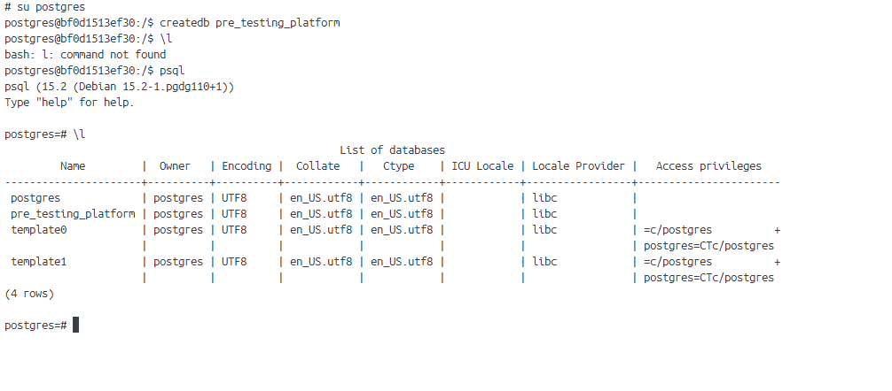
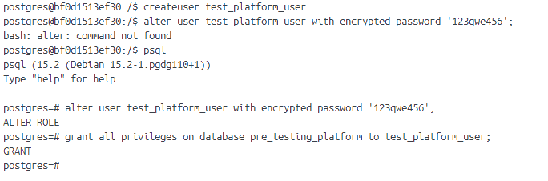
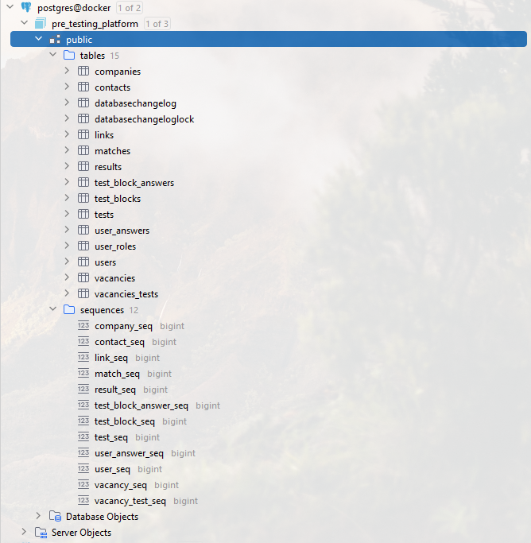

# 1 - DDL скрипты для postgres

### Цель:

Реализовать спроектированную схему в postgres

***

### 1. Подготовить DDL скрипты

* Для начала составили скрипты, с которыми можно ознакомиться <a href="../script">здесь</a>
* Следующим шагом подготовили первый <a href="changelog-1.0.yaml">changelog</a> для liquibase

### 2. Создать БД

### 3. Создать пользователя для данной БД

### 4. Выполнить скрипты

<pre>
2023-03-26T23:00:49.529+03:00  INFO 9200 --- [           main] liquibase.database                       : Set default schema name to public
2023-03-26T23:00:49.694+03:00  INFO 9200 --- [           main] liquibase.lockservice                    : Successfully acquired change log lock
2023-03-26T23:00:49.971+03:00  INFO 9200 --- [           main] liquibase.changelog                      : Creating database history table with name: public.databasechangelog
2023-03-26T23:00:49.987+03:00  INFO 9200 --- [           main] liquibase.changelog                      : Reading from public.databasechangelog
Running Changeset: db/changelog/1/changelog-1.0.yaml::1::Filimonov Artem
2023-03-26T23:00:50.189+03:00  INFO 9200 --- [           main] liquibase.changelog                      : SQL in file db/changelog/1/create-table-users.sql executed
2023-03-26T23:00:50.194+03:00  INFO 9200 --- [           main] liquibase.changelog                      : ChangeSet db/changelog/1/changelog-1.0.yaml::1::Filimonov Artem ran successfully in 33ms
Running Changeset: db/changelog/1/changelog-1.0.yaml::2::Filimonov Artem
2023-03-26T23:00:50.216+03:00  INFO 9200 --- [           main] liquibase.changelog                      : SQL in file db/changelog/1/create-table-user-roles.sql executed
2023-03-26T23:00:50.218+03:00  INFO 9200 --- [           main] liquibase.changelog                      : ChangeSet db/changelog/1/changelog-1.0.yaml::2::Filimonov Artem ran successfully in 13ms
Running Changeset: db/changelog/1/changelog-1.0.yaml::3::Filimonov Artem
2023-03-26T23:00:50.235+03:00  INFO 9200 --- [           main] liquibase.changelog                      : SQL in file db/changelog/1/create-table-matches.sql executed
2023-03-26T23:00:50.238+03:00  INFO 9200 --- [           main] liquibase.changelog                      : ChangeSet db/changelog/1/changelog-1.0.yaml::3::Filimonov Artem ran successfully in 16ms
Running Changeset: db/changelog/1/changelog-1.0.yaml::4::Filimonov Artem
2023-03-26T23:00:50.259+03:00  INFO 9200 --- [           main] liquibase.changelog                      : SQL in file db/changelog/1/create-table-companies.sql executed
2023-03-26T23:00:50.261+03:00  INFO 9200 --- [           main] liquibase.changelog                      : ChangeSet db/changelog/1/changelog-1.0.yaml::4::Filimonov Artem ran successfully in 18ms
Running Changeset: db/changelog/1/changelog-1.0.yaml::5::Filimonov Artem
2023-03-26T23:00:50.279+03:00  INFO 9200 --- [           main] liquibase.changelog                      : SQL in file db/changelog/1/create-table-contacts.sql executed
2023-03-26T23:00:50.282+03:00  INFO 9200 --- [           main] liquibase.changelog                      : ChangeSet db/changelog/1/changelog-1.0.yaml::5::Filimonov Artem ran successfully in 15ms
Running Changeset: db/changelog/1/changelog-1.0.yaml::6::Filimonov Artem
2023-03-26T23:00:50.303+03:00  INFO 9200 --- [           main] liquibase.changelog                      : SQL in file db/changelog/1/create-table-links.sql executed
2023-03-26T23:00:50.305+03:00  INFO 9200 --- [           main] liquibase.changelog                      : ChangeSet db/changelog/1/changelog-1.0.yaml::6::Filimonov Artem ran successfully in 19ms
Running Changeset: db/changelog/1/changelog-1.0.yaml::7::Filimonov Artem
2023-03-26T23:00:50.321+03:00  INFO 9200 --- [           main] liquibase.changelog                      : SQL in file db/changelog/1/create-table-vacancies.sql executed
2023-03-26T23:00:50.324+03:00  INFO 9200 --- [           main] liquibase.changelog                      : ChangeSet db/changelog/1/changelog-1.0.yaml::7::Filimonov Artem ran successfully in 14ms
Running Changeset: db/changelog/1/changelog-1.0.yaml::8::Filimonov Artem
2023-03-26T23:00:50.339+03:00  INFO 9200 --- [           main] liquibase.changelog                      : SQL in file db/changelog/1/create-table-tests.sql executed
2023-03-26T23:00:50.342+03:00  INFO 9200 --- [           main] liquibase.changelog                      : ChangeSet db/changelog/1/changelog-1.0.yaml::8::Filimonov Artem ran successfully in 14ms
Running Changeset: db/changelog/1/changelog-1.0.yaml::9::Filimonov Artem
2023-03-26T23:00:50.357+03:00  INFO 9200 --- [           main] liquibase.changelog                      : SQL in file db/changelog/1/create-table-results.sql executed
2023-03-26T23:00:50.360+03:00  INFO 9200 --- [           main] liquibase.changelog                      : ChangeSet db/changelog/1/changelog-1.0.yaml::9::Filimonov Artem ran successfully in 13ms
Running Changeset: db/changelog/1/changelog-1.0.yaml::10::Filimonov Artem
2023-03-26T23:00:50.374+03:00  INFO 9200 --- [           main] liquibase.changelog                      : SQL in file db/changelog/1/create-table-vacancies-tests.sql executed
2023-03-26T23:00:50.376+03:00  INFO 9200 --- [           main] liquibase.changelog                      : ChangeSet db/changelog/1/changelog-1.0.yaml::10::Filimonov Artem ran successfully in 11ms
Running Changeset: db/changelog/1/changelog-1.0.yaml::11::Filimonov Artem
2023-03-26T23:00:50.393+03:00  INFO 9200 --- [           main] liquibase.changelog                      : SQL in file db/changelog/1/create-table-test-blocks.sql executed
2023-03-26T23:00:50.397+03:00  INFO 9200 --- [           main] liquibase.changelog                      : ChangeSet db/changelog/1/changelog-1.0.yaml::11::Filimonov Artem ran successfully in 15ms
Running Changeset: db/changelog/1/changelog-1.0.yaml::12::Filimonov Artem
2023-03-26T23:00:50.417+03:00  INFO 9200 --- [           main] liquibase.changelog                      : SQL in file db/changelog/1/create-table-test-block-answers.sql executed
2023-03-26T23:00:50.420+03:00  INFO 9200 --- [           main] liquibase.changelog                      : ChangeSet db/changelog/1/changelog-1.0.yaml::12::Filimonov Artem ran successfully in 18ms
Running Changeset: db/changelog/1/changelog-1.0.yaml::13::Filimonov Artem
2023-03-26T23:00:50.439+03:00  INFO 9200 --- [           main] liquibase.changelog                      : SQL in file db/changelog/1/create-table-user-answers.sql executed
2023-03-26T23:00:50.442+03:00  INFO 9200 --- [           main] liquibase.changelog                      : ChangeSet db/changelog/1/changelog-1.0.yaml::13::Filimonov Artem ran successfully in 15ms
Running Changeset: db/changelog/1/changelog-1.0.yaml::14::Filimonov Artem
2023-03-26T23:00:50.456+03:00  INFO 9200 --- [           main] liquibase.changelog                      : SQL in file db/changelog/1/create-table-vacancies-tests.sql executed
2023-03-26T23:00:50.458+03:00  INFO 9200 --- [           main] liquibase.changelog                      : ChangeSet db/changelog/1/changelog-1.0.yaml::14::Filimonov Artem ran successfully in 9ms
Running Changeset: db/changelog/1/changelog-1.0.yaml::15::Filimonov Artem
2023-03-26T23:00:50.489+03:00  INFO 9200 --- [           main] liquibase.changelog                      : SQL in file db/changelog/1/create-sequences.sql executed
2023-03-26T23:00:50.491+03:00  INFO 9200 --- [           main] liquibase.changelog                      : ChangeSet db/changelog/1/changelog-1.0.yaml::15::Filimonov Artem ran successfully in 28ms
2023-03-26T23:00:50.501+03:00  INFO 9200 --- [           main] liquibase.lockservice                    : Successfully released change log lock
</pre>

