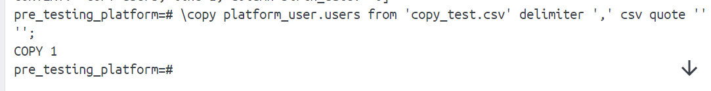

# 5 - DML в PostgreSQL

### Цель:

- Написать запрос с конструкциями SELECT, JOIN
- Написать запрос с добавлением данных INSERT INTO
- Написать запрос с обновлением данных с UPDATE FROM
- Использовать using для оператора DELETE

***

### 1. Заполним таблицы данными:

### 2. Напишем запрос по своей базе с регулярным выражением:

### 3. Напишем запрос по своей базе с использованием LEFT JOIN и INNER JOIN:

### 4. Напишем запрос на добавление данных с выводом информации о добавленных строках:

### 5. Напишем  запрос с обновлением данных используя UPDATE FROM:

### 6. Напишем  запрос для удаления данных с оператором DELETE используя join с другой таблицей с помощью using:

### *. Приведём пример использования утилиты COPY:

1. Создали файл [copy_test.csv](copy_test.csv)
2. Выполнили команду через терминал <pre> \copy platform_user.users from 'copy_test.csv' delimiter ',' csv quote ''''; </pre>
3. Проверили результат

