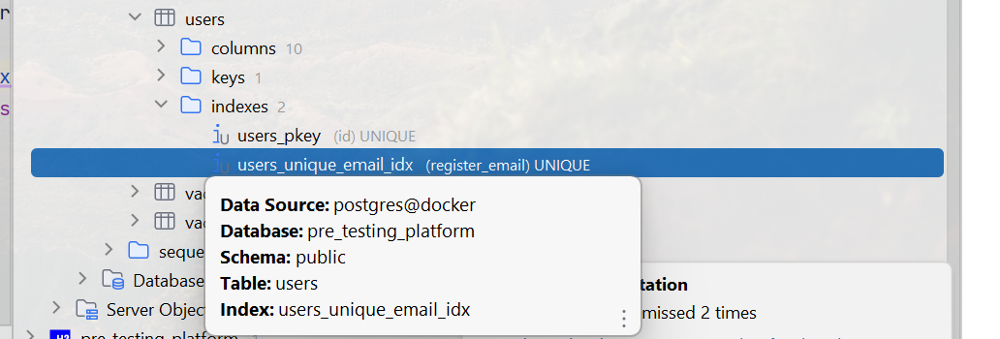
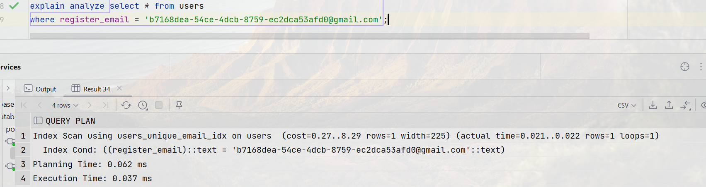
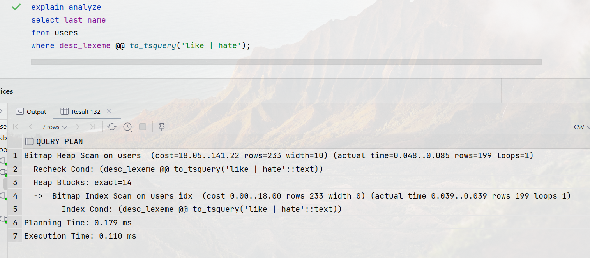
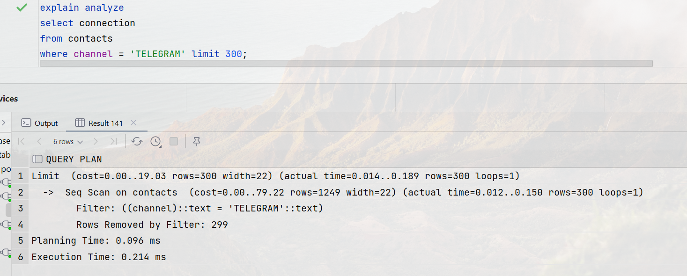
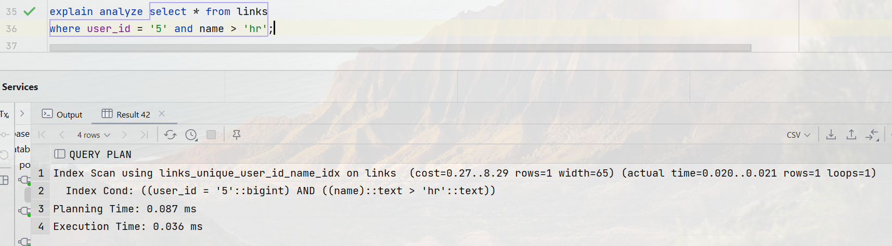

# 6 - Индексы PostgreSQL

### Цель:

- Знать и уметь применять основные виды индексов PostgreSQL
- Построить и анализировать план выполнения запроса
- Уметь оптимизировать запросы для с использованием индексов

***

### 1. Создать индекс к какой-либо из таблиц вашей БД:

Так как индексы уже были добавлены ранее, можем использовать уже имеющийся уникальный индекс из таблицы users для поиска по email:

<pre>
create unique index users_unique_email_idx on users (register_email);
</pre>

### 2. Прислать текстом результат команды explain, в которой используется данный индекс:

<pre>
Index Scan using users_unique_email_idx on users  (cost=0.27..8.29 rows=1 width=225) (actual time=0.021..0.022 rows=1 loops=1)
  Index Cond: ((register_email)::text = 'b7168dea-54ce-4dcb-8759-ec2dca53afd0@gmail.com'::text)
Planning Time: 0.062 ms
Execution Time: 0.037 ms
</pre>

### 3. Реализовать индекс для полнотекстового поиска:

Добавим индекс в таблицу users для полнотекстового поиска (Только для демонстрации):

<pre>
alter table users add column desc_lexeme tsvector;
update users
set desc_lexeme = to_tsvector(description);

create index users_idx on users using GIN (desc_lexeme);

explain analyze
select last_name
from users
where desc_lexeme @@ to_tsquery('like | hate');

--result
Bitmap Heap Scan on users  (cost=18.05..141.22 rows=233 width=10) (actual time=1.429..1.484 rows=199 loops=1)
  Recheck Cond: (desc_lexeme @@ to_tsquery('like | hate'::text))
  Heap Blocks: exact=14
  ->  Bitmap Index Scan on users_idx  (cost=0.00..18.00 rows=233 width=0) (actual time=1.416..1.417 rows=199 loops=1)
        Index Cond: (desc_lexeme @@ to_tsquery('like | hate'::text))
Planning Time: 0.315 ms
Execution Time: 1.510 ms
</pre>

### 4. Реализовать индекс на часть таблицы или индекс на поле с функцией:

Добавим частичный индекс в таблицу contacts для индексации профилей телеграмм:

<pre>
create index name on contacts (connection) where channel = 'TELEGRAM';
</pre>

<pre>
Limit  (cost=0.00..19.03 rows=300 width=22) (actual time=0.014..0.189 rows=300 loops=1)
  ->  Seq Scan on contacts  (cost=0.00..79.22 rows=1249 width=22) (actual time=0.012..0.150 rows=300 loops=1)
        Filter: ((channel)::text = 'TELEGRAM'::text)
        Rows Removed by Filter: 299
Planning Time: 0.096 ms
Execution Time: 0.214 ms
</pre>

### 5. Создать индекс на несколько полей:

Так как индексы уже были добавлены ранее, можем использовать уже имеющийся уникальный индекс из таблицы links для поиска по user_id и названию ссылки:

<pre>
create unique index links_unique_user_id_name_idx on links (user_id, name);
</pre>

<pre>
Index Scan using links_unique_user_id_name_idx on links  (cost=0.27..8.29 rows=1 width=65) (actual time=0.020..0.021 rows=1 loops=1)
  Index Cond: ((user_id = '5'::bigint) AND ((name)::text > 'hr'::text))
Planning Time: 0.087 ms
Execution Time: 0.036 ms
</pre>

### *. Остальные индексы БД:

Остальные индексы уже были описаны во втором дз, посмотреть можно <a href="../2/2.md">тут</a>