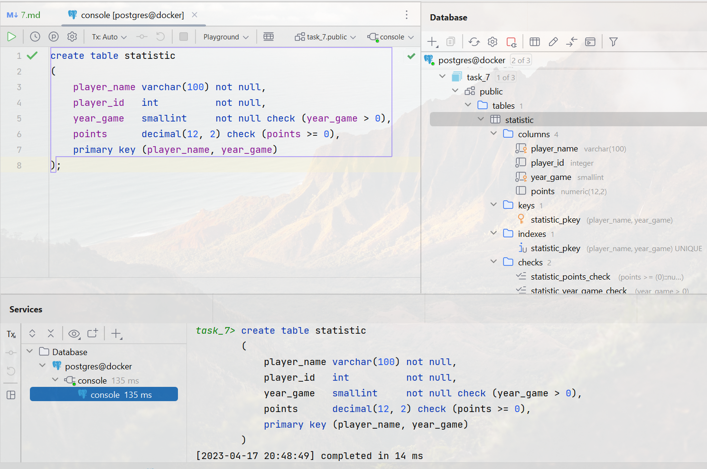
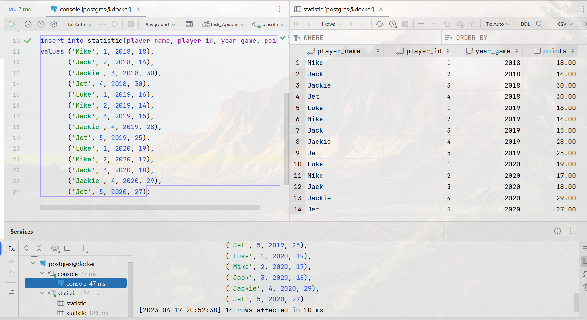
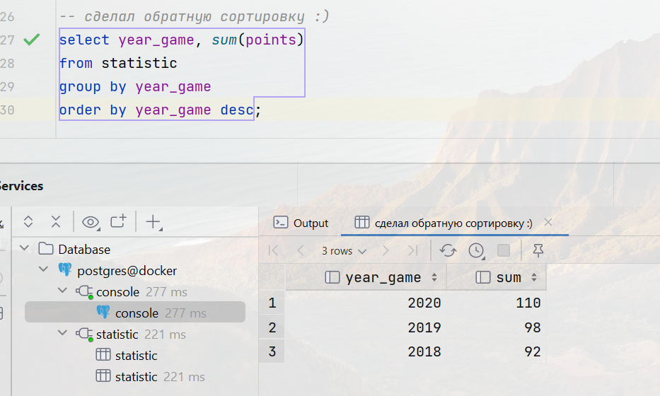
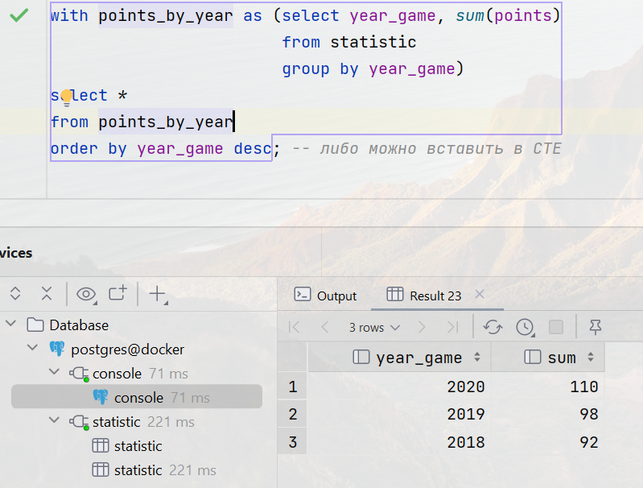
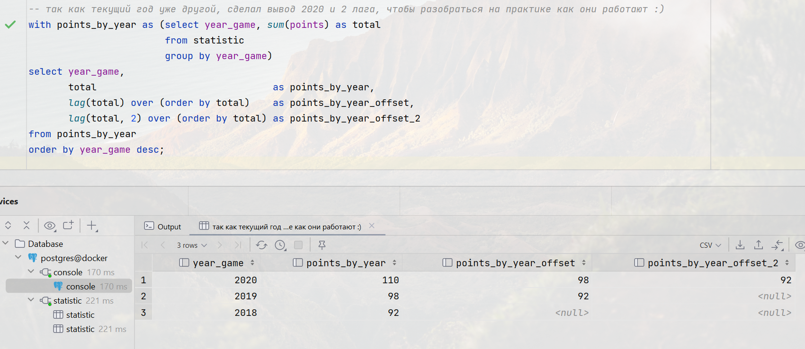

# 7 - DML: агрегация и сортировка, CTE, аналитические функции

### Цель:

- Научиться использовать функцию LAG и CTE
- Посчитать кол-во очков по всем игрокам за текущий год и за предыдущий

***

### 1. Создайте таблицу и наполните ее данными:

### 2. Заполнить данными:

### 3. Написать запрос суммы очков с группировкой и сортировкой по годам:

<pre>
-- сделал обратную сортировку :)
select year_game, sum(points)
from statistic
group by year_game
order by year_game desc;
</pre>

### 4. Написать cte показывающее тоже самое:

<pre>
with points_by_year as (select year_game, sum(points)
                        from statistic
                        group by year_game)
select *
from points_by_year
order by year_game desc; -- либо можно вставить в CTE
</pre>

### 5. Используя функцию LAG вывести кол-во очков по всем игрокам за текущий год и за предыдущий:

<pre>
-- так как текущий год уже другой, сделал вывод 2020 и 2 лага, чтобы разобраться на практике как они работают :)
with points_by_year as (select year_game, sum(points) as total
                        from statistic
                        group by year_game)
select year_game,
       total                               as points_by_year,
       lag(total) over (order by total)    as points_by_year_offset,
       lag(total, 2) over (order by total) as points_by_year_offset_2
from points_by_year
order by year_game desc;
</pre>