# 8 - Репликация

### Цель:

- Сделать физическую и логическую репликации

***

### Физическая репликация:

1. Проверим, что наш мастер, не является репликой и создадим слот репликации с названием "replica_1"

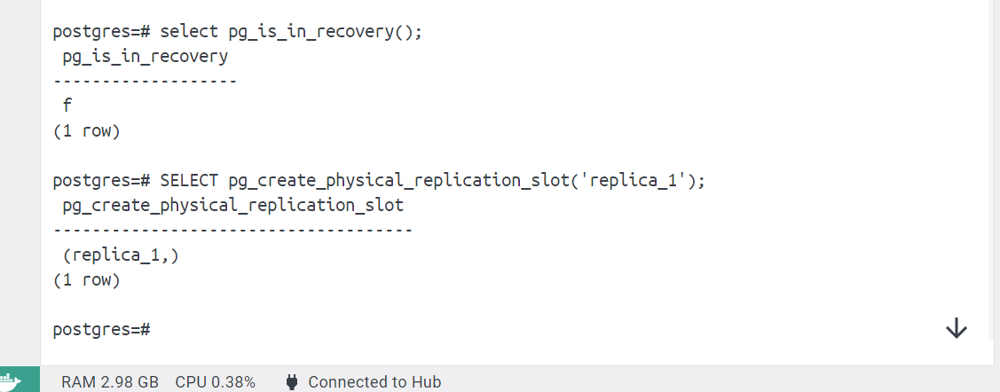

2. Создадим контейнер, с названием otus_replica_1, который мы будем использовать в качестве ведомого

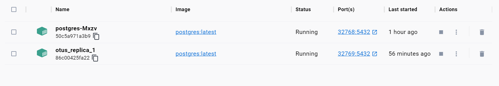

3. Пропишем адрес ведомого сервера в pg_hba.conf мастера

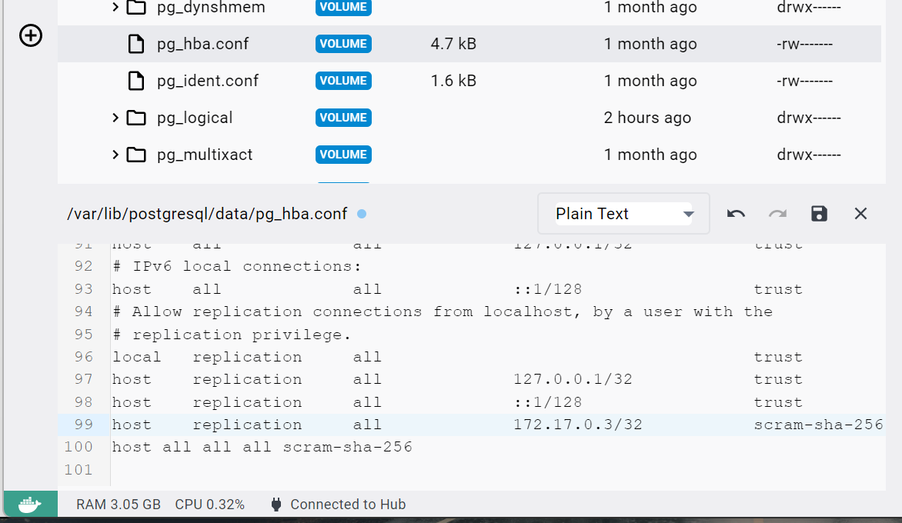

4. Перечитаем наш конфиг файл

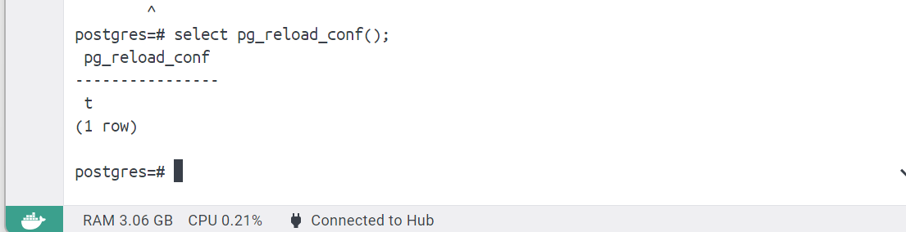

5. Удалим директорию data у реплики и выполним команду pg_basebackup, после чего перезапустим контейнер

commands:
<pre>
rm -rf /var/lib/postgresql/data/

su - postgres
pg_basebackup -h 172.17.0.2 -R -D /var/lib/postgresql/data/ -U postgres --slot=replica_1
</pre>

6. После перезапуска проверим, что репликация выполнена, а наш текущий кластер стал репликой

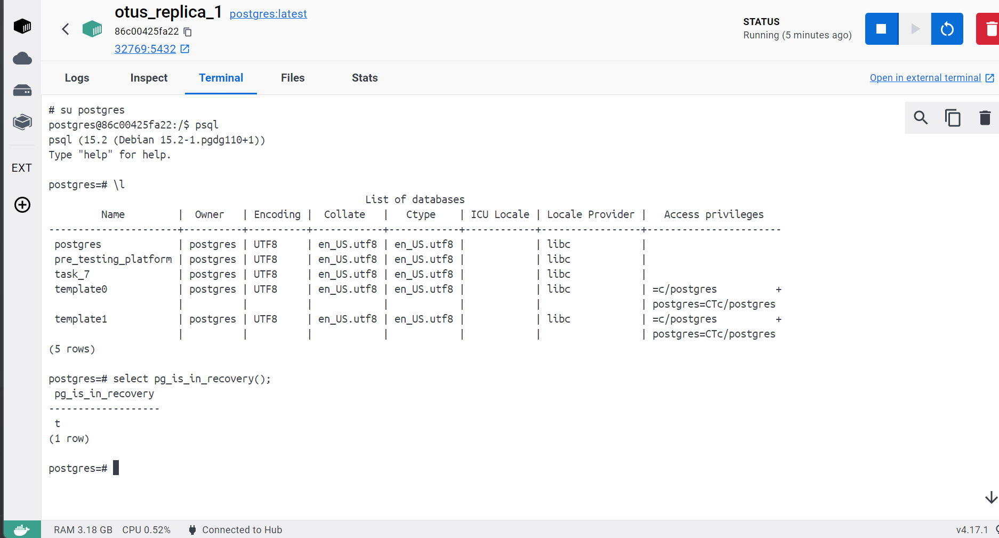

7. Добавим отставание на 5 минут от мастера, и перезапустим контейнер

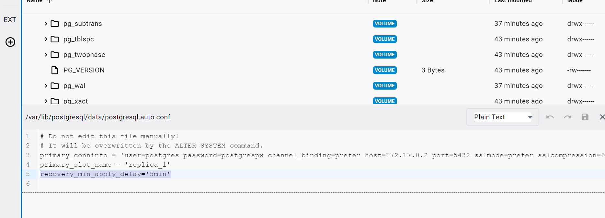

8. Создадим на мастере бд для тестирования отставания

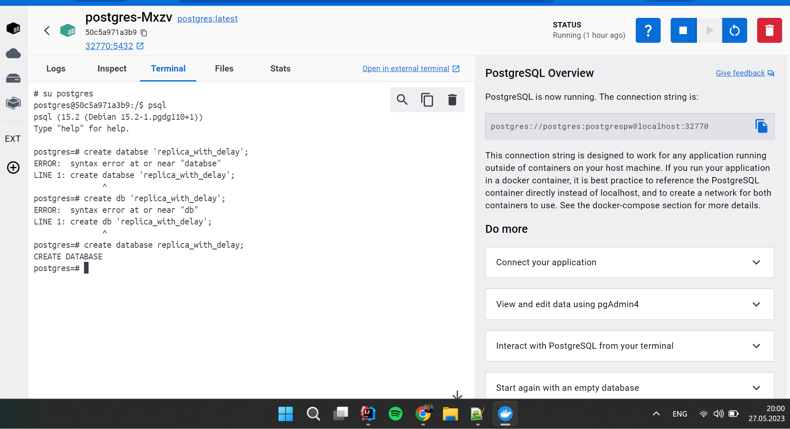

9. Проверим, что на реплике её еще нет

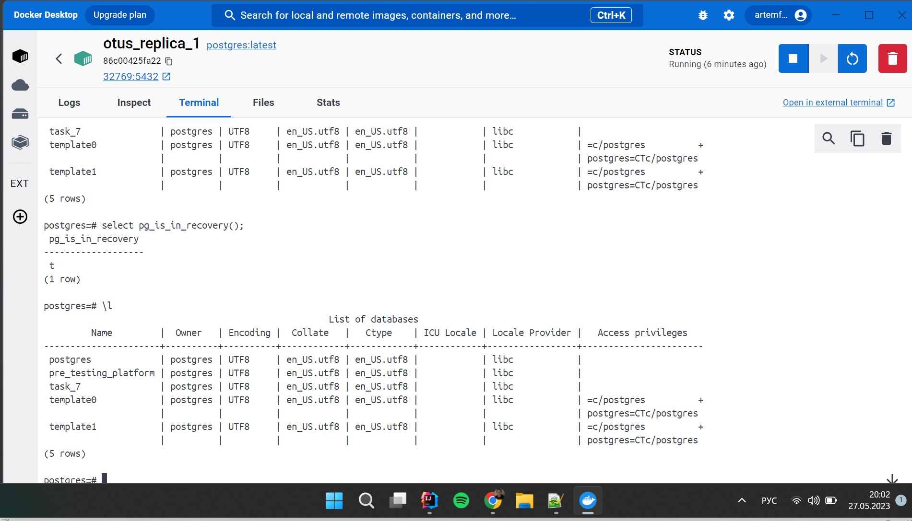

10. Проверим спустя 5 минут (На последних 3 скринах время указано снизу справа)

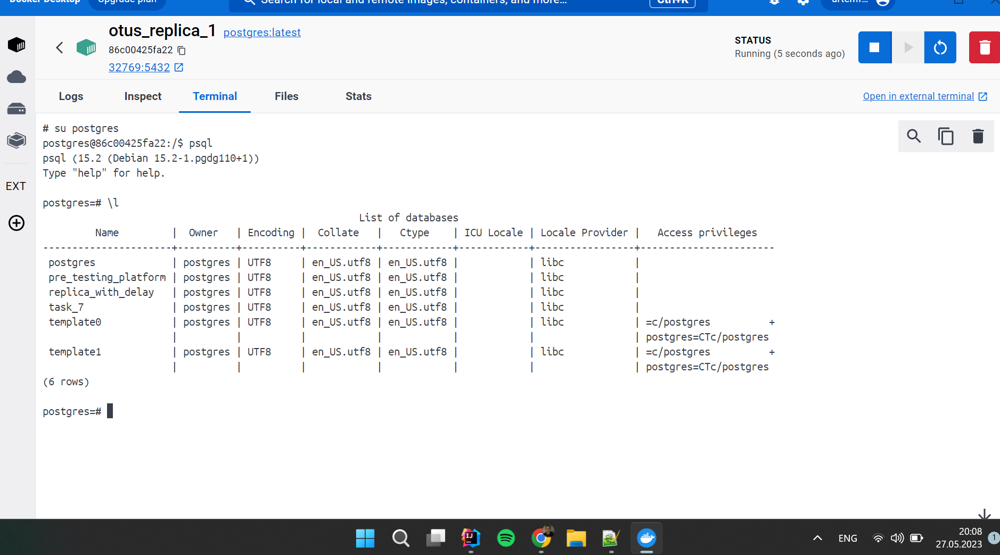

11. В заключение посмотрим статусы на мастере и на реплике

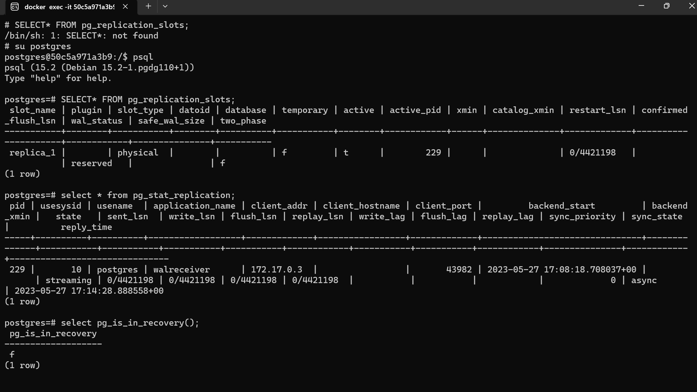

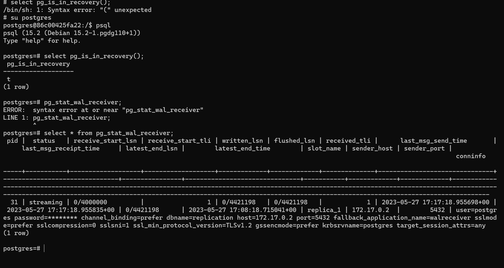

### Логическая репликация:

1. Добавим в созданную таблицу replica_with_delay поля и данные

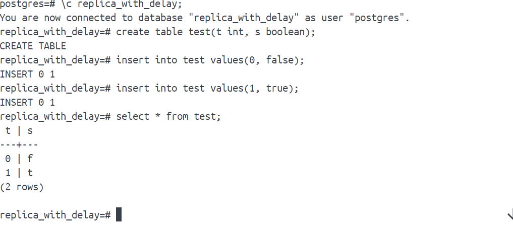

2. Добавим контейнер для логической репликации

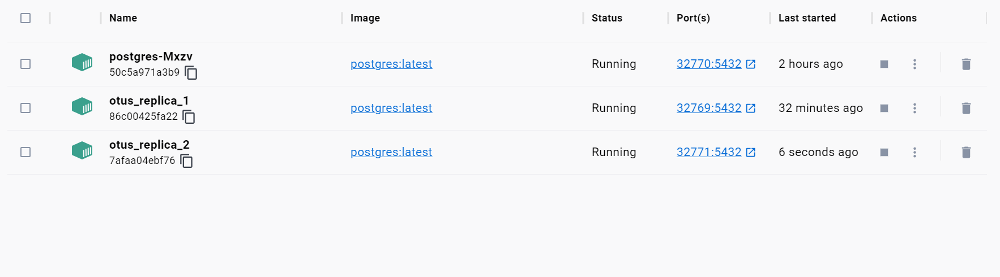

3. Выполним команду на мастере и перезапустим контейнер

<pre>
ALTER SYSTEM SET wal_level = logical;
</pre>

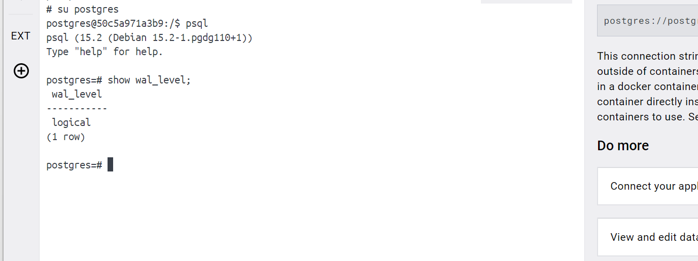

4. Создадим публикацию и посмотрим что получилось

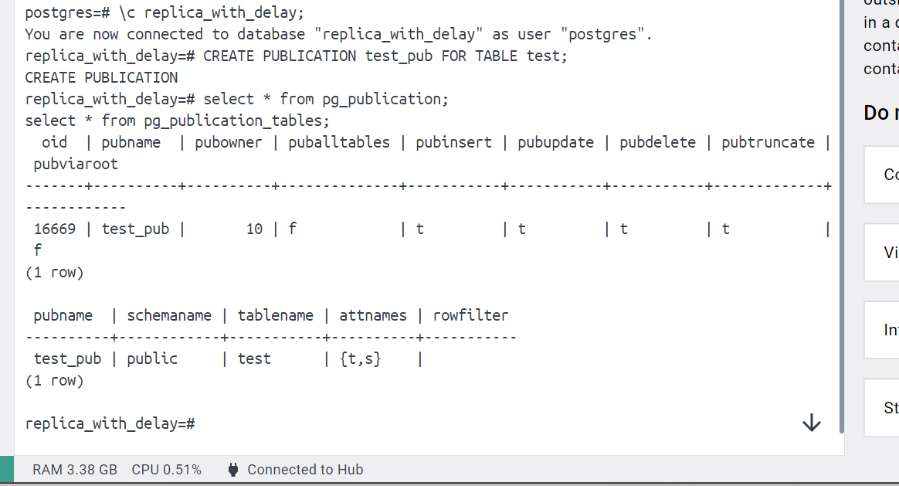

5. Создадим на второй реплике таблицу, подписку и проверим, что все получилось

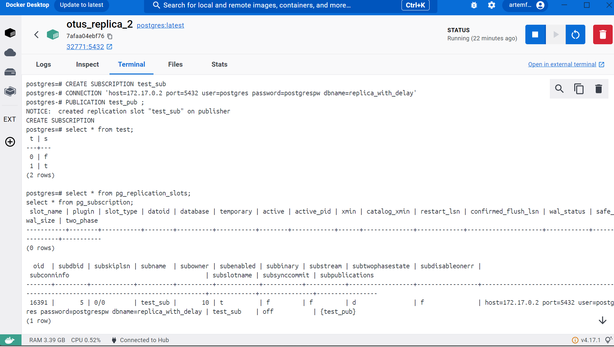

6. Добавим данные на мастере и проверим, что они успешно реплицировались

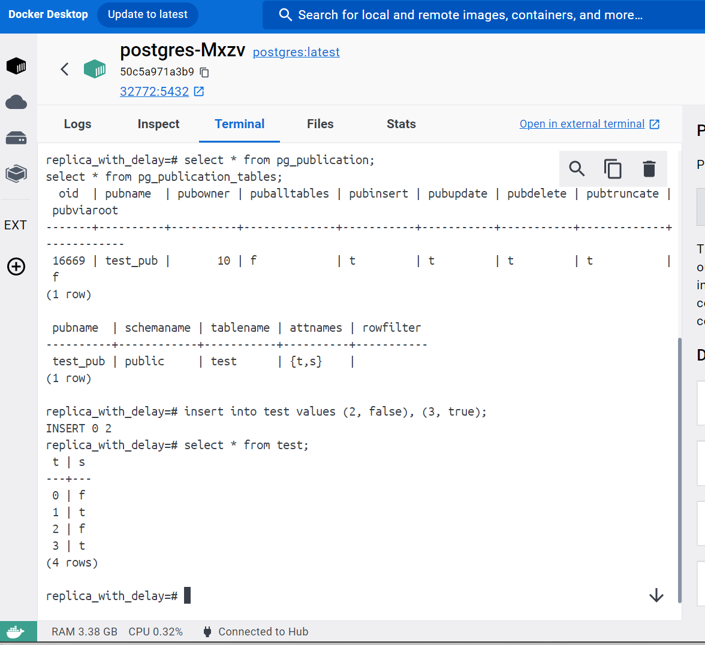

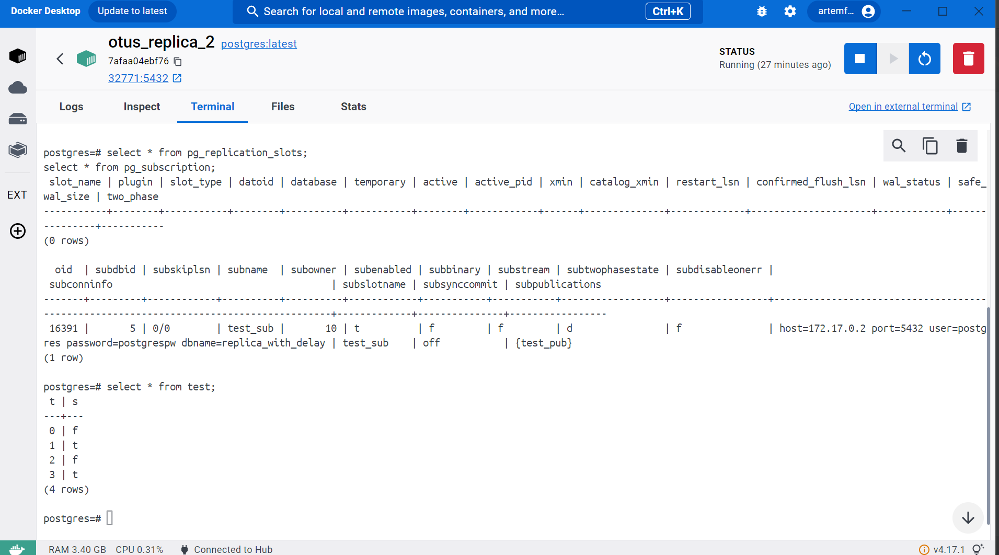