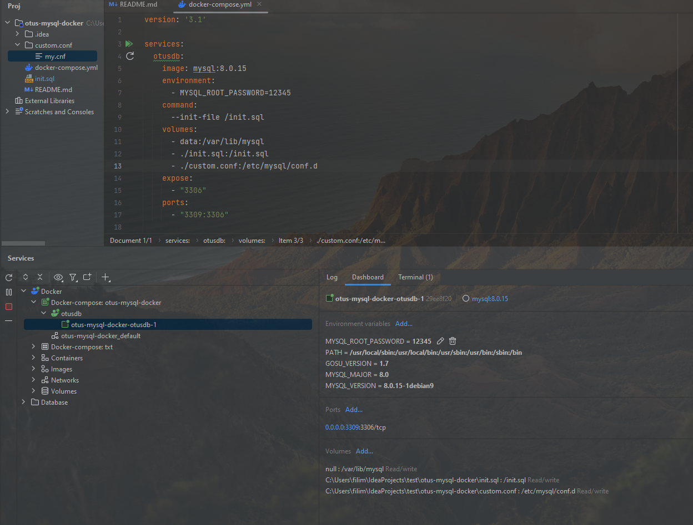
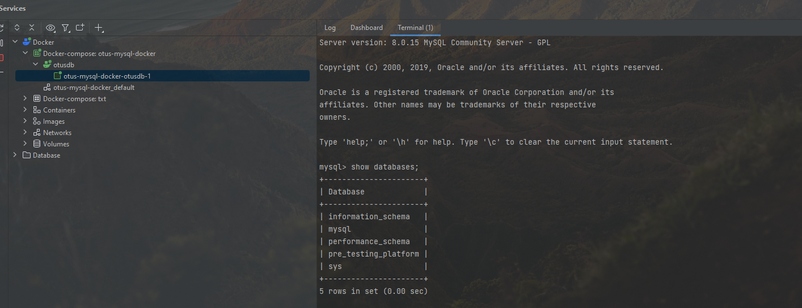
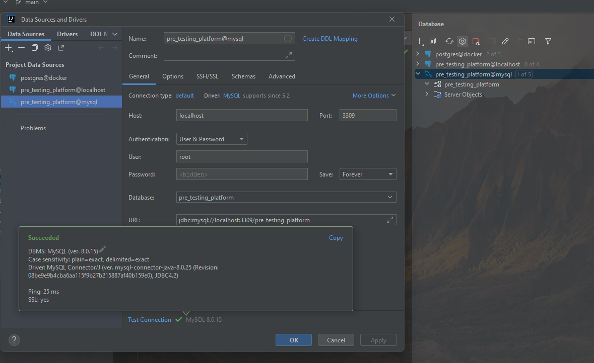

# 9 - Внутренняя архитектура СУБД MySQL

### Цель:

- Создать базу данных MySQL в докере
- Упаковка скриптов создания БД в контейнер

***

### 1. Прописать sql скрипт для создания своей БД в init.sql:

<pre>
CREATE database pre_testing_platform;
USE pre_testing_platform;
</pre>

### 2. Проверить запуск и работу контейнера следуя описанию в репозитории:

